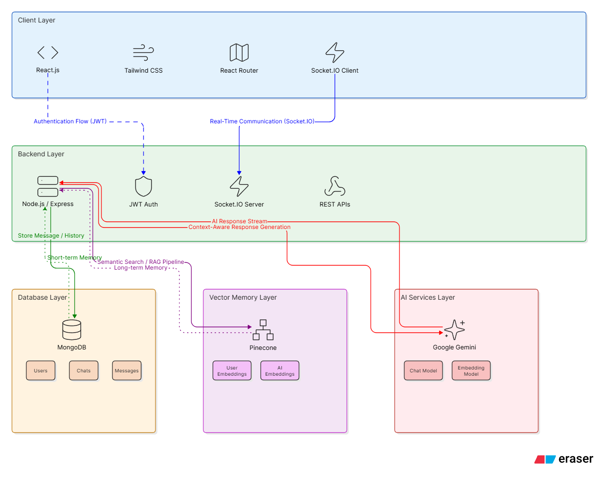
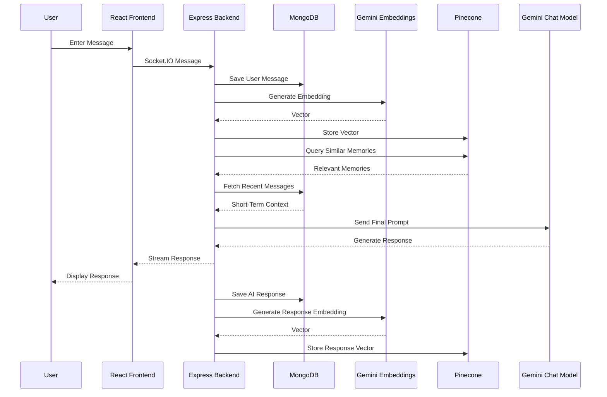

# Aurex AI 🤖

> **An intelligent, context-aware AI chat application with advanced memory systems, real-time messaging, and semantic search powered by Pinecone and Google Gemini.**

---

## 📋 Table of Contents

- [Project Overview](#project-overview)
- [Key Features](#key-features)
- [Tech Stack](#tech-stack)
- [Architecture](#architecture)
- [Screenshots](#screenshots)
- [Authentication Flow](#authentication-flow)
- [RAG Pipeline](#rag-pipeline)
- [Hybrid Memory System](#hybrid-memory-system)
- [Real-Time Messaging](#real-time-messaging)
- [Installation](#installation)
- [Environment Variables](#environment-variables)
- [API Endpoints](#api-endpoints)
- [Project Structure](#project-structure)

---

## 🎯 Project Overview

# Aurex AI

Aurex AI is a full-stack conversational AI application built using React, Node.js, MongoDB, Socket.IO, Pinecone, and Google Gemini.

The application combines Retrieval-Augmented Generation (RAG), vector embeddings, and hybrid memory (short-term + long-term) to deliver context-aware conversations. Users can create multiple chats, retrieve previous conversations, and interact with an AI assistant through a real-time messaging interface.

Key capabilities include JWT authentication, semantic memory retrieval, automatic chat title generation, persistent chat history, and WebSocket-powered communication.

---

## ✨ Key Features

### 1. **User Authentication** 🔐
- Secure user registration with email validation
- Bcrypt password hashing (salt rounds: 10)
- JWT-based authentication with persistent cookies
- Logout functionality with token clearing

### 2. **Chat Management** 💬
- Create new chat sessions
- Retrieve chat history with pagination support
- Rename chats with custom titles
- Delete chats with cascading message deletion
- Automatic chat title generation on first message

### 3. **Real-Time Messaging** ⚡
- Bidirectional communication via Socket.IO
- JWT-authenticated WebSocket connections
- Real-time message broadcasting
- Presence detection and user activity tracking
- Automatic message persistence

### 4. **Retrieval-Augmented Generation (RAG)** 🔍
- Vector embeddings stored in Pinecone
- Semantic similarity search for relevant context retrieval
- Intelligent context window management
- Automatic conversation relevance filtering
- Hybrid memory system (long-term + short-term)

### 5. **Hybrid Memory System** 🧠
- **Long-Term Memory**: Persistent vector storage in Pinecone with metadata filtering
- **Short-Term Context**: Recent conversation history for immediate context
- **Metadata Tagging**: Chat-specific and user-specific memory filtering
- **Memory Cleanup**: Automatic vector deletion on chat removal

### 6. **Google Gemini Integration** 🚀
- Gemini 3.5 Flash model for fast, intelligent responses
- Configurable temperature (default: 0.7) for balanced creativity
- System instruction for consistent personality
- Support for context injection and memory integration
- Real-time response streaming

### 7. **Pinecone Vector Database** 🗂️
- Semantic vector storage with metadata
- High-dimensional embeddings for accurate similarity matching
- Top-K retrieval for optimal context selection
- Metadata filtering for user/chat-specific queries
- Batch operations for scalability

---

## 🛠️ Tech Stack

### Backend
| Technology | Version | Purpose |
|-----------|---------|---------|
| **Node.js** | 18+ | JavaScript runtime |
| **Express.js** | 5.2.1 | REST API framework |
| **Socket.IO** | 4.8.3 | Real-time communication |
| **MongoDB** | 6.0+ | NoSQL database |
| **Mongoose** | 9.4.1 | MongoDB ODM |
| **JWT** | 9.0.3 | Authentication tokens |
| **Bcrypt** | 6.0.0 | Password hashing |
| **Google GenAI** | 1.50.1 | AI/LLM integration |
| **Pinecone** | 7.2.0 | Vector database |
| **CORS** | 2.8.6 | Cross-origin requests |
| **Morgan** | 1.10.1 | HTTP request logging |

### Frontend
| Technology | Version | Purpose |
|-----------|---------|---------|
| **React** | 19.2.6 | UI framework |
| **Vite** | 8.0.12 | Build tool & dev server |
| **React Router** | 7.15.1 | Client-side routing |
| **Axios** | 1.16.1 | HTTP client |
| **Socket.IO Client** | 4.8.3 | WebSocket client |
| **Tailwind CSS** | 4.3.0 | Utility-first CSS |
| **React Markdown** | 10.1.0 | Markdown rendering |
| **React Syntax Highlighter** | 16.1.1 | Code highlighting |
| **Lucide React** | 1.16.0 | Icon library |

### Infrastructure & Services
- **MongoDB Atlas**: Cloud database hosting
- **Pinecone**: Managed vector database
- **Google Cloud**: Generative AI APIs

---

## 🏗️ Architecture



### Data Flow: Message Processing



---

# Screenshots

[RegisterPage](./registerUI.png)

[LoginPage](./loginUI.png)

[ChatsPage](./chats.png)


## 🔐 Authentication Flow

### Registration Flow
```
User Registration Form
    │
    └─► POST /api/auth/register
        ├─► Validate email uniqueness
        ├─► Hash password (bcrypt, rounds: 10)
        ├─► Create user document in MongoDB
        ├─► Generate JWT token
        ├─► Set cookie: token (secure, httpOnly)
        └─► Return success response with user data
```

### Login Flow
```
User Login Form
    │
    └─► POST /api/auth/login
        ├─► Find user by email
        ├─► Compare password with hash (bcrypt)
        ├─► Generate JWT token
        ├─► Set cookie: token (secure, httpOnly)
        └─► Return success response with user data
```

### Socket.IO Authentication
```
Client connects to WebSocket
    │
    └─► Socket.IO Auth Middleware
        ├─► Extract JWT from cookies
        ├─► Verify JWT signature
        ├─► Fetch user from MongoDB
        ├─► Attach user to socket context
        └─► Allow connection or reject
```

### Protected Endpoint Access
```
API Request
    │
    └─► authUser Middleware
        ├─► Extract & verify JWT
        ├─► Check token expiration
        ├─► Attach user to request
        └─► Allow route access
```

---

## 🧠 RAG (Retrieval-Augmented Generation) Pipeline

### The Power of Hybrid Memory

Aurex AI uses a sophisticated **two-tier memory system** that combines semantic search with recent context to deliver highly relevant, personalized responses:

#### 1. **Long-Term Memory (Semantic Search)**
- **Storage**: Pinecone Vector Database
- **Process**: 
  - Every message is converted to a high-dimensional vector embedding
  - Vectors are stored with rich metadata (userId, chatId, timestamp, content)
  - Uses cosine similarity for semantic matching
- **Retrieval**: 
  - Query vector is compared against stored embeddings
  - Top-5 most semantically similar messages retrieved
  - Metadata filtering ensures user/chat-specific results

#### 2. **Short-Term Memory (Recent Context)**
- **Storage**: MongoDB chat history
- **Scope**: Last N messages in current conversation
- **Purpose**: Maintain conversation continuity and coherence
- **Advantage**: No embedding latency, immediate availability

### RAG Pipeline Steps

```
1. USER MESSAGE RECEIVED
   ├─ Content: "Tell me about JavaScript closures"
   ├─ UserId: user_123
   └─ ChatId: chat_456

2. MESSAGE STORAGE
   └─ Save to MongoDB messages collection

3. VECTOR EMBEDDING GENERATION
   └─ Convert message text to 736-dimensional vector (Gemini embeddings)

4. VECTOR STORAGE
   ├─ Store in Pinecone with metadata:
   │  ├─ messageId: unique identifier
   │  ├─ userId: for user-specific filtering
   │  ├─ chatId: for chat-specific filtering
   │  └─ timestamp: for temporal filtering
   └─ Makes message searchable by semantic meaning

5. SEMANTIC SIMILARITY SEARCH
   ├─ Query current message vector in Pinecone
   ├─ Find top-5 most similar messages from user's history
   ├─ Filter by userId to ensure privacy
   └─ Results example:
      • "What are closures in JS?" (0.92 similarity)
      • "Explain scope in JavaScript" (0.88 similarity)
      • "Function scope and closure" (0.85 similarity)

6. CONTEXT ASSEMBLY
   ├─ Long-Term Context (from Pinecone):
   │  └─ Retrieved similar messages with user's previous questions
   ├─ Short-Term Context (from recent messages):
   │  └─ Last 3-5 messages in current chat
   └─ System Context:
      ├─ AI personality (Hinglish, North Indian vibe)
      ├─ User profile
      └─ Domain-specific instructions

7. PROMPT ENGINEERING
   ├─ Combine all contexts into structured prompt
   ├─ Inject personality instructions
   ├─ Set temperature: 0.7 (balanced creativity)
   └─ Template:
      ```
      <systemInstruction>
        <identity>Your name is Aurex</identity>
        <persona>Hinglish, North Indian vibe</persona>
      </systemInstruction>
      
      <longTermMemory>
        [Retrieved similar past messages]
      </longTermMemory>
      
      <conversationContext>
        [Recent chat history]
      </conversationContext>
      
      <userMessage>
        [Current user message]
      </userMessage>
      ```

8. AI RESPONSE GENERATION
   ├─ Call Google Gemini 3.5 Flash API
   ├─ Stream response back to client
   └─ Response includes:
      • Contextual understanding from long-term memory
      • Coherence with short-term conversation
      • Personality-infused tone

9. RESPONSE STORAGE & INDEXING
   ├─ Save AI response to MongoDB
   ├─ Generate vector for AI response
   ├─ Store in Pinecone for future context
   └─ Makes AI responses searchable for better future context

10. REAL-TIME BROADCAST
    └─ Socket.IO emits response to client
       ├─ Display message with formatting
       ├─ Update chat timestamps
       └─ Update UI in real-time
```

### Context Window Size

- **Short-Term Window**: Last 5 messages in conversation
- **Long-Term Retrieval**: Top 5 semantically similar messages
- **Total Context**: ~10-15 relevant messages sent to Gemini
- **Token Budget**: Optimized for Gemini Flash's context window

### Privacy & Isolation

- All queries filtered by `userId` in Pinecone
- No cross-user data leakage
- Chat-specific filtering available for multi-chat scenarios
- Metadata-based access control

---

## 💾 Hybrid Memory System

### Data Model

```
USER
├─ _id: ObjectId
├─ email: String (unique)
├─ password: String (hashed with bcrypt)
├─ fullName
│  ├─ firstName: String
│  └─ lastName: String
├─ createdAt: Date
└─ updatedAt: Date

CHAT
├─ _id: ObjectId
├─ user: ObjectId (ref: User)
├─ title: String (auto-generated from first message)
├─ lastActivity: Date (updated on each message)
├─ createdAt: Date
└─ updatedAt: Date

MESSAGE
├─ _id: ObjectId
├─ user: ObjectId (ref: User)
├─ chat: ObjectId (ref: Chat)
├─ content: String
├─ role: String (enum: ['user', 'model', 'system'])
├─ createdAt: Date
└─ updatedAt: Date

PINECONE VECTOR (Long-Term Memory)
├─ id: String (messageId)
├─ values: Float32Array (1536 dimensions)
├─ metadata
│  ├─ userId: String (filter key)
│  ├─ chatId: String (optional filter)
│  ├─ role: String ('user' | 'model')
│  ├─ timestamp: String
│  └─ preview: String (first 50 chars)
└─ created_at: Timestamp
```

### Memory Lifecycle

```
1. MESSAGE CREATION (MongoDB)
   └─ Insert into messages collection
      └─ Indexed by: userId, chatId, createdAt

2. VECTOR GENERATION (Implicit via Gemini)
   └─ Convert text to 1536-dim embedding

3. VECTOR STORAGE (Pinecone)
   ├─ Upsert vector with messageId as key
   ├─ Attach metadata for filtering
   └─ Enable fast semantic search

4. RETRIEVAL (RAG Query)
   ├─ Query vector from current message
   ├─ Filter by userId for privacy
   ├─ Top-K retrieval (K=5)
   └─ Return matched message IDs & scores

5. MEMORY CLEANUP (On chat deletion)
   ├─ Identify all message IDs in chat
   ├─ Delete from MongoDB messages
   ├─ Delete vectors from Pinecone
   └─ Update chat status
```

### Memory Optimization

- **Automatic Indexing**: Messages auto-indexed on creation
- **Lazy Loading**: Vectors created only on storage (not retrieval)
- **Batch Operations**: Multiple vectors stored/deleted in batches
- **Metadata Filtering**: Efficient user/chat-specific queries
- **Approximate Similarity**: Uses HNSW algorithm for O(log n) search

---

## ⚡ Socket.IO Real-Time Messaging

### Key Events

#### **Client → Server**

```javascript
// Send message to AI
socket.emit('ai-message', {
  chat: 'chat_id_123',
  content: 'Your message here',
  timestamp: Date.now()
});
```

#### **Server → Client**

```javascript
// Broadcast response
socket.emit('ai-response', {
  messageId: 'msg_id_456',
  chatId: 'chat_id_123',
  content: 'AI response here',
  role: 'model',
  timestamp: Date.now()
});
```

### Connection Lifecycle

1. **Handshake**: Client connects with JWT in cookie
2. **Authentication**: Server validates token
3. **User Attachment**: Socket.user set with user data
4. **Event Binding**: Listen for 'ai-message' events
5. **Message Processing**: Handle, generate, broadcast
6. **Cleanup**: Remove socket on disconnect

### Error Handling

- Invalid token → Connection rejected
- Expired token → Re-authentication required
- Network errors → Automatic reconnection (client-side)
- Server errors → Error event sent to client

---

## 📦 Installation

### Prerequisites

- **Node.js**: v18+ ([Download](https://nodejs.org))
- **MongoDB**: v6.0+ (MongoDB Atlas free tier or local)
- **Git**: For version control

### Environment Setup

#### 1. Clone Repository
```bash
git clone https://github.com/ajel477/ChatBot-webSocket-geminiAPI
cd aurex-ai
```

#### 2. Backend Setup

```bash
cd Backend

# Install dependencies
npm install

# Create .env file (see Environment Variables section)
cp .env.example .env

# Start development server
npm run dev
```

Server will run on `http://localhost:3000`

#### 3. Frontend Setup

```bash
cd ../Frontend

# Install dependencies
npm install

# Start development server
npm run dev
```
Frontend will be available at `http://localhost:5173`

---


```

### Environment Variable Details

| Variable | Description | Example | Required |
|----------|-------------|---------|----------|
| `MONGO_URI` | MongoDB connection string | `mongodb+srv://...` | ✅ |
| `JWT_SECRET` | Secret key for signing JWTs | `min 32 characters` | ✅ |
| `GOOGLE_API_KEY` | Google Gemini API key | `AIzaSy...` | ✅ |
| `PINECONE_API_KEY` | Pinecone API key | `pcsk_...` | ✅ |
| `PORT` | Server port | `3000` | ❌ (default: 3000) |
| `NODE_ENV` | Environment type | `development` or `production` | ❌ |
| `CLIENT_URL` | Frontend origin for CORS | `http://localhost:5173` | ✅ |

### Security Best Practices

⚠️ **Never commit `.env` to version control**

```bash
# Add to .gitignore
echo ".env" >> .gitignore
```

Use environment variable management tools:
- **Development**: `.env.local` with git ignore
- **Production**: Environment variables in hosting platform
- **CI/CD**: GitHub Secrets, GitLab CI Variables, etc.

---

## 📡 API Endpoints

### Authentication Endpoints

#### **POST** `/api/auth/register`
Register a new user
```bash
curl -X POST http://localhost:3000/api/auth/register \
  -H "Content-Type: application/json" \
  -d '{
    "fullName": {
      "firstName": "John",
      "lastName": "Doe"
    },
    "email": "john@example.com",
    "password": "SecurePassword123"
  }'
```

**Response (201)**:
```json
{
  "message": "User registered successfully",
  "user": {
    "email": "john@example.com",
    "fullName": {
      "firstName": "John",
      "lastName": "Doe"
    },
    "id": "user_id_here"
  }
}
```

#### **POST** `/api/auth/login`
Login existing user
```bash
curl -X POST http://localhost:3000/api/auth/login \
  -H "Content-Type: application/json" \
  -d '{
    "email": "john@example.com",
    "password": "SecurePassword123"
  }'
```

**Response (200)**:
```json
{
  "message": "user logged in successfully",
  "user": {
    "email": "john@example.com",
    "_id": "user_id_here",
    "fullName": {
      "firstName": "John",
      "lastName": "Doe"
    }
  }
}
```

#### **GET** `/api/auth/profile`
Get authenticated user's profile
```bash
curl -X GET http://localhost:3000/api/auth/profile \
  -H "Cookie: token=jwt_token_here"
```

**Response (200)**:
```json
{
  "user": {
    "_id": "user_id_here",
    "fullName": {
      "firstName": "John",
      "lastName": "Doe"
    },
    "email": "john@example.com"
  }
}
```

### Chat Endpoints

#### **POST** `/api/chat`
Create new chat
```bash
curl -X POST http://localhost:3000/api/chat \
  -H "Content-Type: application/json" \
  -H "Cookie: token=jwt_token_here" \
  -d '{
    "title": "JavaScript Questions"
  }'
```

**Response (201)**:
```json
{
  "message": "Chat created successfully",
  "chat": {
    "_id": "chat_id_here",
    "title": "JavaScript Questions",
    "lastActivity": "2024-06-05T10:30:00Z",
    "user": "user_id_here"
  }
}
```

#### **GET** `/api/chat`
Get all chats for user
```bash
curl -X GET http://localhost:3000/api/chat \
  -H "Cookie: token=jwt_token_here"
```

**Response (200)**:
```json
{
  "message": "Chats retrieved successfully",
  "chats": [
    {
      "_id": "chat_id_1",
      "title": "JavaScript Questions",
      "lastActivity": "2024-06-05T10:30:00Z",
      "createdAt": "2024-06-04T09:15:00Z"
    },
    {
      "_id": "chat_id_2",
      "title": "New Chat",
      "lastActivity": "2024-06-05T11:45:00Z",
      "createdAt": "2024-06-05T11:40:00Z"
    }
  ]
}
```

#### **GET** `/api/chat/:chatId`
Get specific chat
```bash
curl -X GET http://localhost:3000/api/chat/chat_id_here \
  -H "Cookie: token=jwt_token_here"
```

**Response (200)**:
```json
{
  "message": "Chat retrieved successfully",
  "chat": {
    "_id": "chat_id_here",
    "title": "JavaScript Questions",
    "lastActivity": "2024-06-05T10:30:00Z",
    "createdAt": "2024-06-04T09:15:00Z"
  }
}
```

---

## 📁 Project Structure

```
aurex-ai/
├── Backend/
│   ├── .env                          # Environment variables
│   ├── .env.example                  # Example env file
│   ├── .gitignore
│   ├── package.json                  # Dependencies & scripts
│   ├── server.js                     # Express server entry
│   │
│   ├── public/                       # Static files (built frontend)
│   │   ├── index.html                # SPA root HTML
│   │   └── assets/                   # Compiled JS/CSS
│   │
│   └── src/
│       ├── app.js                    # Express app setup
│       │
│       ├── controllers/              # Request handlers
│       │   ├── authController.js     # Auth logic
│       │   └── chatController.js     # Chat logic
│       │
│       ├── routes/                   # API route definitions
│       │   ├── auth.routes.js        # /api/auth
│       │   └── chat.routes.js        # /api/chat
│       │
│       ├── middlewares/              # Express middlewares
│       │   └── auth.middleware.js    # JWT verification
│       │
│       ├── models/                   # MongoDB schemas
│       │   ├── user.model.js         # User schema
│       │   ├── chat.model.js         # Chat schema
│       │   └── message.model.js      # Message schema
│       │
│       ├── services/                 # Business logic
│       │   ├── ai.service.js         # Gemini API integration
│       │   └── vector.service.js     # Pinecone operations
│       │
│       ├── sockets/
│       │   └── socket.server.js      # Socket.IO setup & handlers
│       │
│       └── Database/
│           └── mongodb.js            # MongoDB connection
│
├── Frontend/
│   ├── .gitignore
│   ├── package.json                  # React dependencies
│   ├── vite.config.js                # Vite config
│   ├── eslint.config.js              # ESLint rules
│   ├── index.html                    # HTML template
│   │
│   └── src/
│       ├── main.jsx                  # React entry point
│       ├── index.css                 # Global styles
│       │
│       ├── pages/                    # Page components
│       │   ├── LoginPage.jsx         # Authentication
│       │   ├── RegisterPage.jsx      # User registration
│       │   └── ChatPage.jsx          # Main chat interface
│       │
│       ├── components/               # Reusable components
│       │   ├── AuthLayout.jsx        # Auth wrapper
│       │   ├── ChatSidebar.jsx       # Chat list
│       │   ├── ChatWindow.jsx        # Message display
│       │   └── MessageBubble.jsx     # Message component
│       │
│       ├── context/                  # React Context API
│       │   └── (context providers)
│       │
│       ├── routes/
│       │   └── AppRoutes.jsx         # Route configuration
│       │
│       └── services/
│           ├── api.jsx               # REST API calls
│           └── socket.js             # Socket.IO client
│
└── README.md                         # This file
```

### Directory Explanations

#### Backend Structure

**`controllers/`**
- Handle incoming HTTP requests
- Process user input and validation
- Call services for business logic
- Return responses to client

**`services/`**
- Core business logic
- AI integration (Gemini)
- Vector operations (Pinecone)
- Database operations (not direct)

**`models/`**
- Mongoose schemas defining data structure
- Data validation
- Relationships between collections

**`routes/`**
- Define API endpoints
- Middleware chain per route
- Route parameter extraction

**`middlewares/`**
- JWT verification
- Error handling
- Request preprocessing

**`sockets/`**
- Socket.IO server initialization
- Event handlers
- Real-time communication logic

#### Frontend Structure

**`pages/`**
- Full page components
- Page-level state management
- Connected to routes

**`components/`**
- Reusable UI components
- Composition-based architecture
- Props-driven behavior

**`services/`**
- API communication (Axios)
- Socket.IO client setup
- Data fetching logic

**`context/`**
- Global state management
- User context
- Auth context

**`routes/`**
- Route definitions
- Component mapping
- Navigation structure

---

## 🎯 Quick Start Summary

```bash
# 1. Clone & navigate
git clone https://github.com/ajel477/ChatBot-webSocket-geminiAPI
cd aurex-ai

# 2. Backend setup
cd Backend && npm install && npm run dev

# 3. Frontend setup (new terminal)
cd ../Frontend && npm install && npm run dev

# 4. Open browser
# Frontend: http://localhost:5173
# Backend API: http://localhost:3000
```


